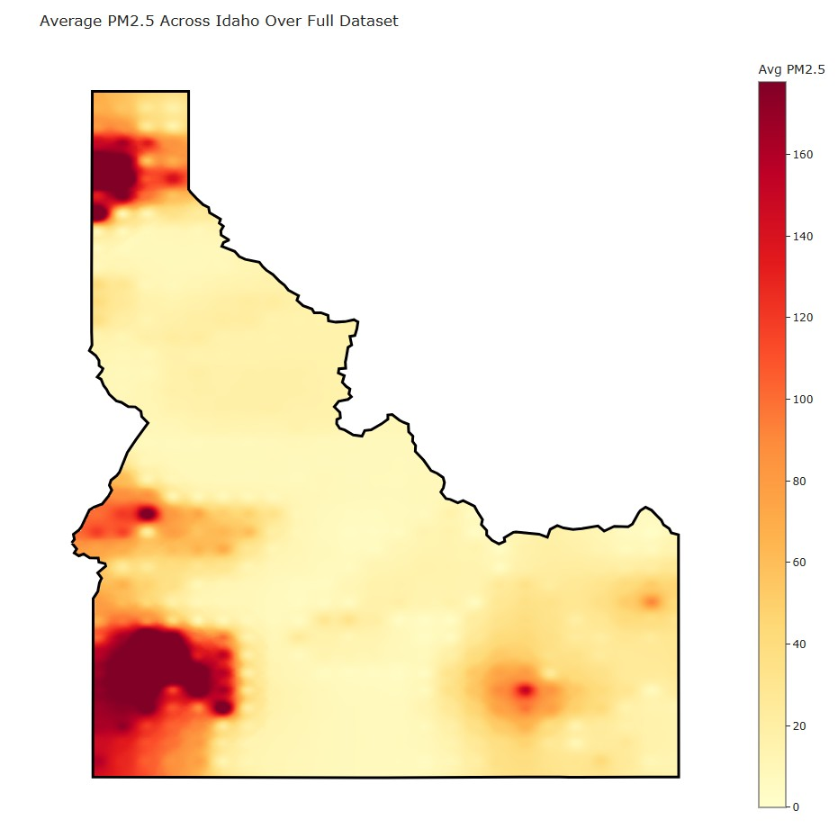

So, as I've been working on this senior project, I realized that one of the things I should explain is what the basis of the project is. PM2.5 is a term for Particulate Matter that is smaller than 2.5 microns, which is a more dangerous variety. It can get deeper into the lungs due to its smaller size, and can have a variety of harmful effects as a direct result of exposure. THe biggest threat is to anyone that has a heart or lung condition, along with children and infants. Additionally, it is frequently associated with the negative health risks from air pollution.

Since the risks of long term exposure (months to years) has been shown to cause premature death and reduced lung functions in children, it is crucial that the amounts of PM2.5 in the air are recorded to better protect individuals. Systems such as the Air Quality System run by the United States Environmental Protection Agency (EPA) and PurpleAir are able to track the concentration through sensors, enabling a real time value for the amount of PM2.5 in the air and historical records going back years. Through combining these API's, we're able to make charts like the one below, that shows the Average Concentration across the state of Idaho from 2023-2025. This chart, while simple, allows for anyone at a glance to look at a map and identify if they're in a higher risk location, something that is only possible due to the efforts made to track the data. Combining ,ultiple data sources provides a clearer image of the truth, allowing us to recognize danger and take preventitive measures that can save lives.

